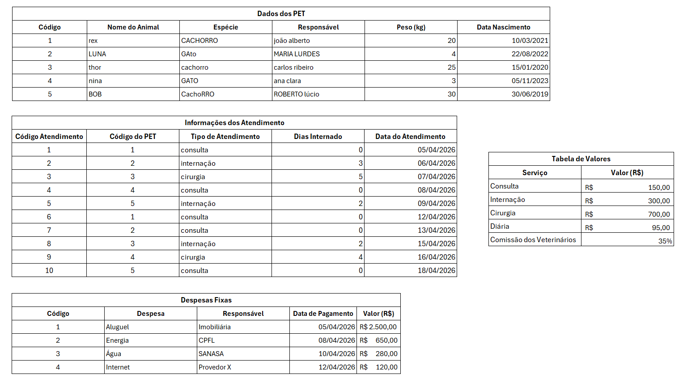

# Sistema de Gestão de Clínica Veterinária

## Contextualização

Uma clínica veterinária está passando por um processo de organização dos seus dados. Atualmente, as informações estão registradas em diferentes tabelas, mas ainda não são utilizadas de forma eficiente para análise e tomada de decisão.

A clínica precisa transformar esses dados em informações úteis, permitindo entender melhor seus atendimentos, seus clientes e sua situação financeira.

---

## Situação

Você foi contratado para organizar os dados de uma clínica veterinária.

A clínica possui registros de:
- animais cadastrados  
- atendimentos realizados  
- serviços oferecidos  
- despesas da clínica  

Seu objetivo é organizar, tratar e analisar esses dados, criando novas tabelas e indicadores que auxiliem na tomada de decisão.

---

## Dados disponíveis

Utilize as tabelas fornecidas:
- Cadastro de PETs  
- Informações dos Atendimentos  
- Serviços  
- Despesas  

---

## O que você deve desenvolver

---

### 1. Padronização dos dados

Crie uma tabela que organize os dados textuais.

Sua tabela deve conter:

- Nome do animal totalmente em maiúsculo  
- Espécie totalmente em minúsculo  
- Nome do responsável com apenas a primeira letra maiúscula  
- Nome completo contendo o nome do responsável e do animal separados por “-”  

---

### 2. Análise dos atendimentos

Crie uma tabela de análise contendo:

- Total de atendimentos realizados  
- Total de dias de internação  
- Média de dias internados  
- Maior período de internação  
- Menor período de internação  

---

### 3. Análise de cadastro

Crie uma tabela com informações gerais dos cadastros:

- Total de animais cadastrados  
- Total de responsáveis cadastrados  

---

### 4. Análise por espécie

Crie uma tabela que permita analisar os dados por espécie.

Inclua:

- Peso médio por espécie  
- Idade média por espécie  
- Animal mais velho de cada espécie  

---

### 5. Análise financeira

Crie uma tabela financeira contendo:

- Total de gastos da clínica  
- Faturamento total com os atendimentos  
- Comissão dos veterinários  
- Lucro final  

---

### 6. Análises adicionais

Crie pelo menos duas análises extras, utilizando os dados disponíveis.

Exemplos de ideias:
- Animal com maior número de atendimentos  
- Tipo de atendimento mais realizado  
- Atendimento mais recente  
- Maior gasto da clínica  

---

## Regras da atividade

- As tabelas devem ser criadas por você  
- Utilize fórmulas para todos os cálculos  
- Organize visualmente as informações  
- Utilize as funções aprendidas em aula  
- Evite valores digitados manualmente (use referências sempre que possível)  

---

## Habilidades avaliadas

- Interpretação de problema  
- Organização de dados  
- Uso correto de fórmulas  
- Padronização de informações  
- Clareza na construção das tabelas  