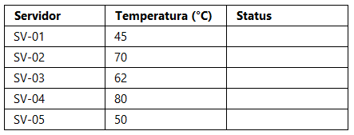
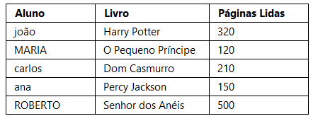
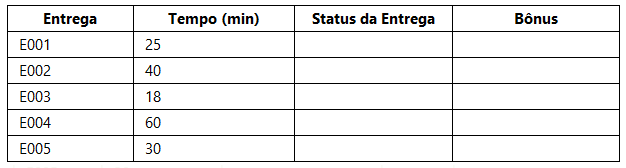
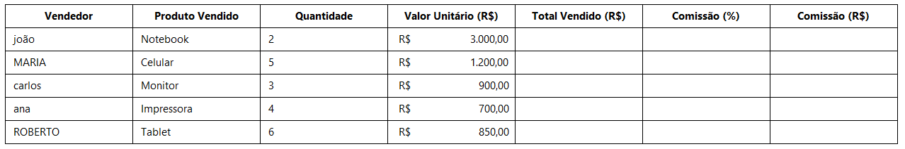

# EXERCÍCIO 1 – Controle de Temperatura dos Servidores

## Contexto

Uma empresa de tecnologia deseja monitorar a temperatura dos servidores para identificar possíveis riscos de superaquecimento.

---

## TABELA 1 – Monitoramento

---

## Regra de classificação

- Temperatura maior ou igual a 65 → Alta
- Temperatura abaixo de 65 → Normal

---

## TABELA 2 – Padronização

| Código MAIÚSCULO | Nº de Caracteres |
| ---------------- | ---------------- |
|                  |                  |

---

## TABELA 3 – Indicadores Gerais

| Indicador            | Resultado |
| -------------------- | --------- |
| Média de temperatura |           |
| Maior temperatura    |           |
| Menor temperatura    |           |
| Total de servidores  |           |

---

  

# EXERCÍCIO 2 – Controle de Leituras da Biblioteca

## Contexto

Uma biblioteca escolar deseja analisar os hábitos de leitura dos alunos e classificar automaticamente o nível de leitura de cada usuário.

---

## TABELA 1 – Registro de Leituras

---

## Regra de classificação

- Páginas lidas maior ou igual a 250 → Leitura Intensa
- Páginas lidas abaixo de 250 → Leitura Moderada

---

## TABELA 2 – Padronização

| Nome Formatado | Livro MAIÚSCULO | Nome Formatado + Livro MAIÚSCULO | Nº Caracteres |
| -------------- | --------------- | -------------------------------- | ------------- |
|                |                 |                                  |               |

---

## TABELA 3 – Indicadores Gerais

| Indicador              | Resultado |
| ---------------------- | --------- |
| Média de páginas lidas |           |
| Maior leitura          |           |
| Menor leitura          |           |
| Total de alunos        |           |

---

  

# EXERCÍCIO 3 – Controle de Entregas

## Contexto

Uma empresa de entregas deseja analisar o desempenho das entregas realizadas e identificar automaticamente o nível de eficiência.

---

## TABELA 1 – Registro de Entregas

---

## Regras

### Status da Entrega

- Tempo menor ou igual a 30 → Rápida
- Tempo acima de 30 → Lenta

### Bônus

- Entregas rápidas → Recebe bônus
- Entregas lentas → Sem bônus

---

## TABELA 2 – Padronização

| Código MAIÚSCULO | Nº Caracteres |
| ---------------- | ------------- |
|                  |               |

---

## TABELA 3 – Indicadores Gerais

| Indicador         | Resultado |
| ----------------- | --------- |
| Média de tempo    |           |
| Maior tempo       |           |
| Menor tempo       |           |
| Total de entregas |           |

---

  

# EXERCÍCIO 4 – Controle de Vendas e Comissão

## Contexto

Uma loja deseja analisar o desempenho dos vendedores e calcular automaticamente a comissão de cada um com base no valor total vendido.

---

## TABELA 1 – Registro de Vendas

---

## Regras de comissão

### Comissão (%)

- Total vendido maior ou igual a R$ 5000 → 15%
- Total vendido abaixo de R$ 5000 → 8%

---

## TABELA 2 – Padronização

| Nome Formatado | Produto MAIÚSCULO | Nome Formatado + Produto MAIÚSCULO | Nº Caracteres |
| -------------- | ----------------- | ---------------------------------- | ------------- |
|                |                   |                                    |               |

---

## TABELA 3 – Indicadores Gerais

| Indicador              | Resultado |
| ---------------------- | --------- |
| Total de vendas        |           |
| Maior venda            |           |
| Menor venda            |           |
| Média de vendas        |           |
| Total de comissão paga |           |

---
